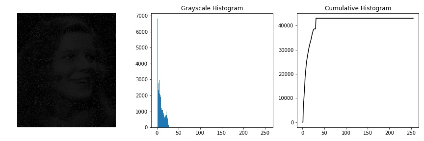
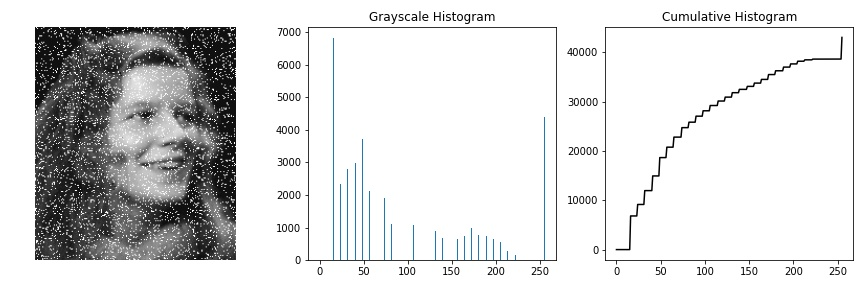
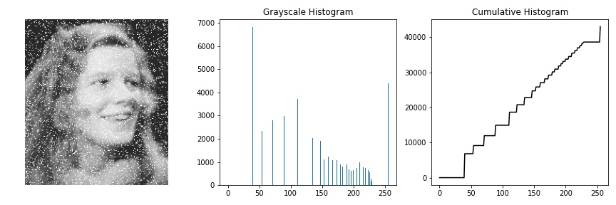
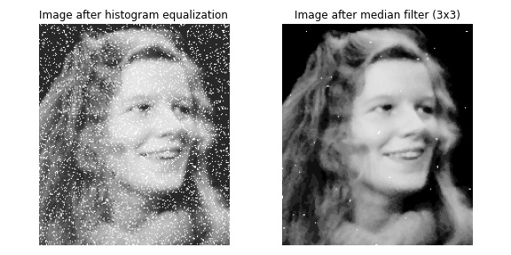
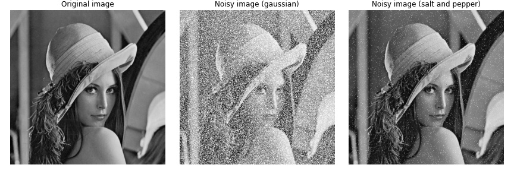
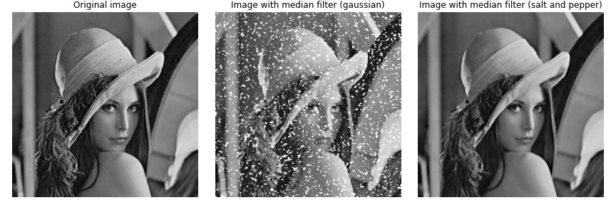
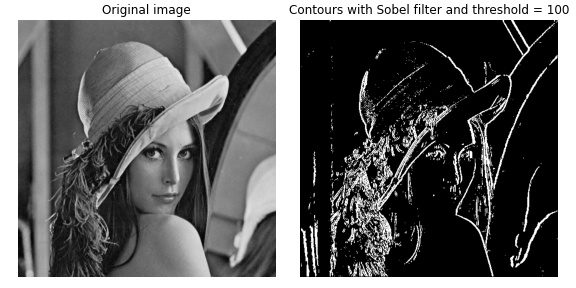
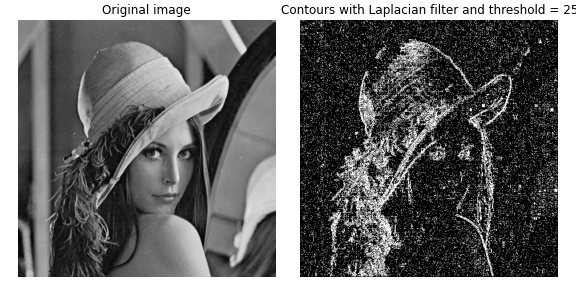
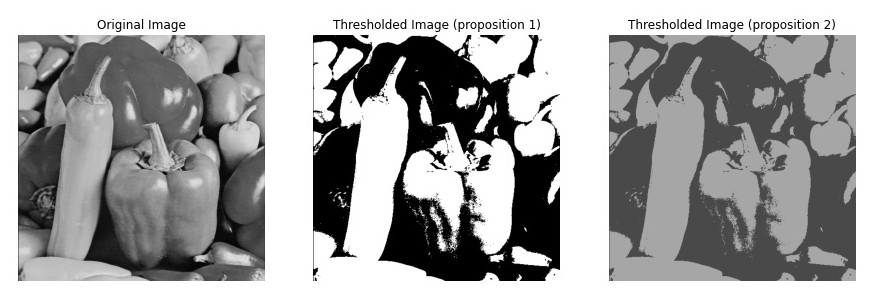
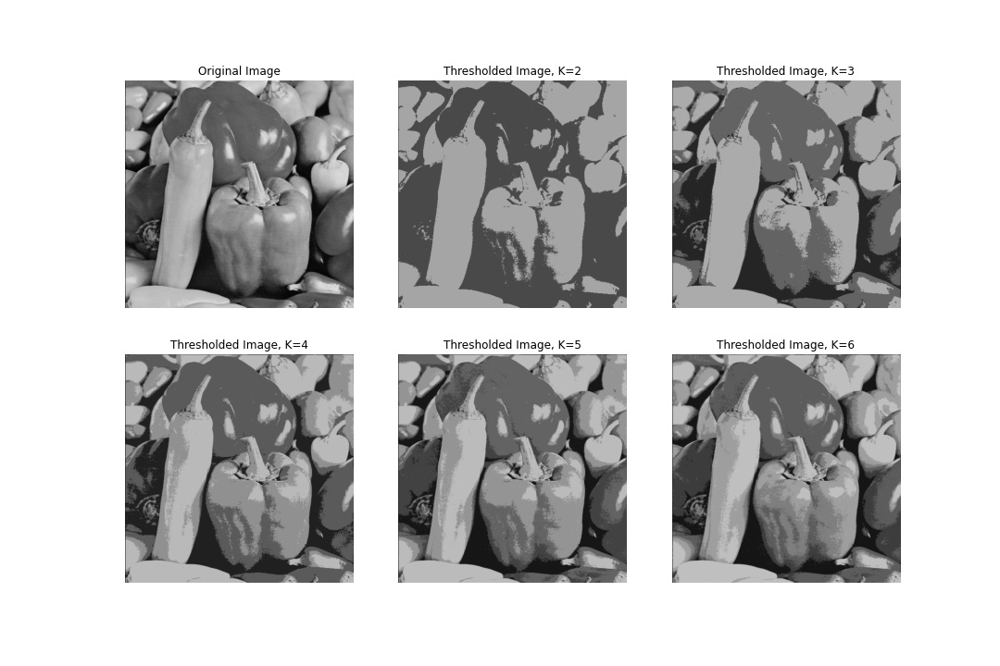

# AI based Image Processing

## Image grayscale histogram and histogram transformations

The following exemple is provided in the file `histogram_transformations.ipynb`:

  
  
  

The images above show the grayscale histogram of an image and the result of applying two histogram transformations: histogram stretching and histogram equalization.

The first image is the original image, the second image is the image after applying the histogram stretching transformation and the third image is the image after applying the histogram equalization transformation.

## Noise reduction using image filtering

The following exemple is provided in the file `noise_reduction.ipynb`:

  
  
  

## Detection of edges in images

The following exemple is provided in the file `characteristics_detection.ipynb`:

  
  
  

Images above show the result of applying edge detection filters to an image. The first image is the original image is the result of applying Sobel filter, the second image is the result of applying the gradient filter and the third image is the result of applying the Laplacian filter.

## Image segmentation using clustering

The following exemple is provided in the file `image_segmentation.ipynb`:

  

Images above show the result of applying image segmentation techniques to an image. The first image is the result of applying binary thresholding and the second image is the result of applying the k-means clustering algorithm.